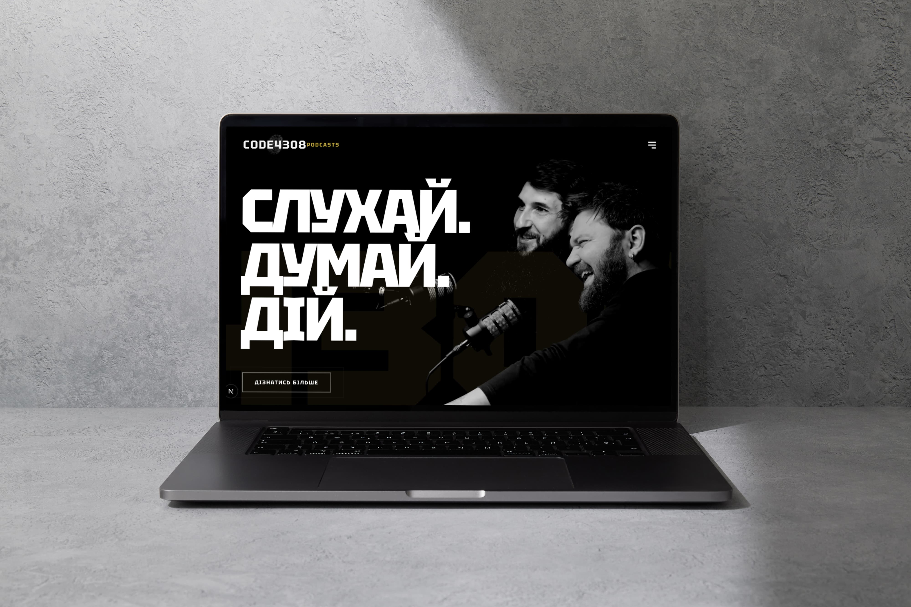

# CODE4308 Website

Modern promotional website for the CODE4308 podcast and community platform.
The project is built with Next.js and includes animated UI sections, a podcast page with embedded YouTube videos, a contacts page, and social/community links.

## Tech Stack

- Next.js 16 (App Router)
- React 19
- TypeScript
- CSS Modules

## Libraries

- `gsap` for scroll-driven animations
- `lenis` for smooth scrolling behavior
- `framer-motion` for UI motion and transitions
- `swiper` for interactive sliders/galleries
- `react-icons` for iconography

## Main Features

- Multi-page structure: Home, Podcasts, Contacts
- Reusable component architecture (`Header`, `Footer`, Home sections, UI utilities)
- Intro animation and smooth page scrolling
- Embedded YouTube podcast episodes
- Responsive navigation with mobile menu
